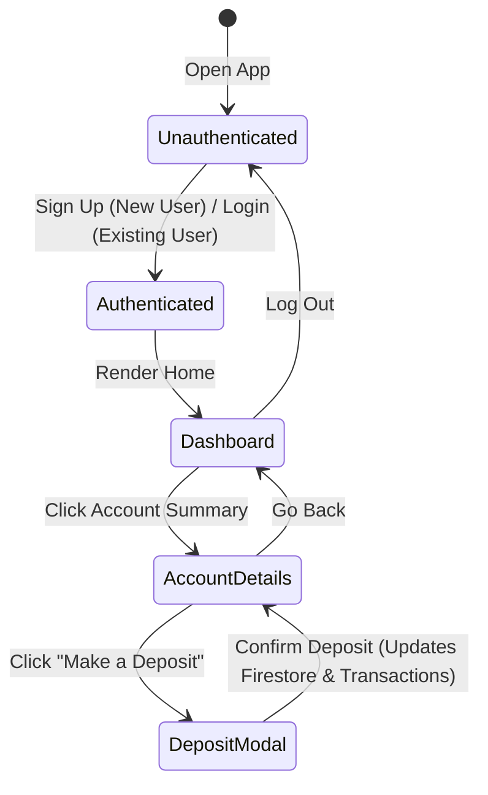

# Data Model: Kids Banking App Web App

This document defines the Firestore collection schemas, validation rules, and state transitions utilized by both the mobile and web banking applications.

## Entities and Schemas

### 1. User
Represents a registered user profile.

- **Firestore Collection**: `users`
- **Document ID**: Auth User UID (`uid`)
- **Schema**:
  ```typescript
  interface UserProfile {
    username: string;   // Unique, lowercase string representing the user's username
    createdAt: Date;    // Timestamp when the user registered
  }
  ```

### 2. Account
Represents the savings account belonging to a user.

- **Firestore Collection**: `accounts`
- **Document ID**: Auto-generated string
- **Schema**:
  ```typescript
  interface SavingsAccount {
    userId: string;                   // References the User document ID (uid)
    balance: number;                  // Current balance in cents (integer)
    interestRate: number;             // APY percentage, e.g. 5.0 for 5% APY
    ytdInterest: number;              // Year-to-Date interest earned in cents (integer)
    lastInterestCalculation: Date;    // Timestamp of the last interest calculation
  }
  ```

### 3. Transaction
Represents a ledger entry of deposits or interest payouts on an account.

- **Firestore Collection**: `transactions`
- **Document ID**: Auto-generated string
- **Schema**:
  ```typescript
  interface Transaction {
    accountId: string;                // References the Account document ID
    amount: number;                   // Transaction amount in cents (integer)
    type: 'DEPOSIT' | 'INTEREST';     // Type of ledger transaction
    date: Date | firebase.firestore.FieldValue; // Timestamp of execution
    description: string;              // Human-readable summary (e.g. "Deposit", "Daily Interest")
  }
  ```

## Validation Rules

### Username
- **Uniqueness**: Enforced before registration by querying the `users` collection for existing documents with the same lowercase username value.
- **Length**: Minimum 3 characters.
- **Format**: Lowercase letters, numbers, and basic symbols (automatically lowercased upon receipt).

### PIN / Password
- **Format**: Exactly 4 numeric digits (`/^\d{4}$/`).
- **Firebase Adaptation**: Firebase Auth requires passwords to be at least 6 characters. To adapt, the application appends `"00"` to the user's 4-digit PIN prior to authentication calls (`auth.ts`).

### Deposits
- **Amount**: Must be a positive integer greater than zero (minimum 1 cent).
- **Scale**: Represented in cents to prevent IEEE 754 floating-point inaccuracies.

## State Transitions and Workflows


