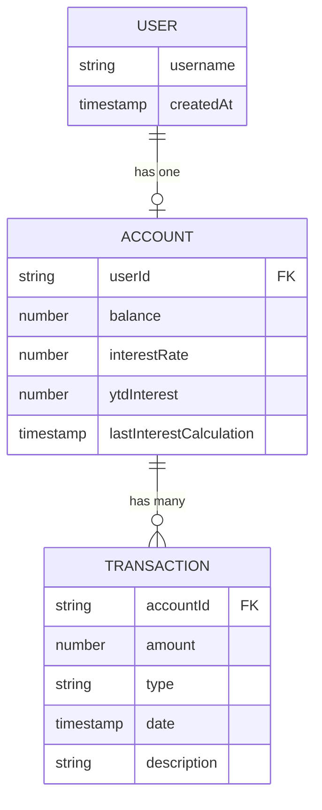

# Data Model: Ionic Capacitor Web App

This document defines the Firestore collection schemas, validation rules, and application state transitions for the CorvusBank Ionic web application.

The web app shares the **exact same Firestore collections** as the existing React Native mobile app. No schema changes are required.

---

## Entities

### 1. User Profile

Represents a registered child user.

- **Firestore Collection**: `users`
- **Document ID**: Firebase Auth UID (`uid`)
- **Fields**:

| Field       | Type        | Description                          |
|-------------|-------------|--------------------------------------|
| `username`  | `string`    | Unique, lowercased username handle   |
| `createdAt` | `timestamp` | Registration timestamp               |

```typescript
interface UserProfile {
  username: string;    // lowercased, unique
  createdAt: Date;
}
```

### 2. Savings Account

Represents a child's savings account.

- **Firestore Collection**: `accounts`
- **Document ID**: Auto-generated
- **Relationship**: `userId` → references `users/{uid}`

| Field                      | Type        | Description                                    |
|----------------------------|-------------|------------------------------------------------|
| `userId`                   | `string`    | References the owning User document (uid)      |
| `balance`                  | `number`    | Current balance in **cents** (integer)          |
| `interestRate`             | `number`    | APY percentage (e.g., `5.0` = 5% APY)          |
| `ytdInterest`              | `number`    | Year-to-date interest earned in **cents**       |
| `lastInterestCalculation`  | `timestamp` | Last time interest was calculated               |

```typescript
interface SavingsAccount {
  userId: string;
  balance: number;                  // cents
  interestRate: number;             // APY %
  ytdInterest: number;              // cents
  lastInterestCalculation: Date;
}
```

### 3. Transaction

Represents a single deposit or interest payout entry.

- **Firestore Collection**: `transactions`
- **Document ID**: Auto-generated
- **Relationship**: `accountId` → references `accounts/{accountId}`

| Field         | Type                        | Description                                 |
|---------------|-----------------------------|---------------------------------------------|
| `accountId`   | `string`                    | References the parent Account document      |
| `amount`      | `number`                    | Amount in **cents** (always positive)        |
| `type`        | `'DEPOSIT' \| 'INTEREST'`   | Transaction category                        |
| `date`        | `timestamp`                 | Server timestamp when transaction occurred   |
| `description` | `string`                    | Human-readable label (e.g., "Deposit")      |

```typescript
interface Transaction {
  accountId: string;
  amount: number;                   // cents
  type: 'DEPOSIT' | 'INTEREST';
  date: Date;                       // Firestore Timestamp → .toDate()
  description: string;
}
```

---

## Validation Rules

### Username
| Rule         | Constraint                                                 |
|--------------|------------------------------------------------------------|
| Uniqueness   | Checked via Firestore query before registration            |
| Length        | Minimum 3 characters                                       |
| Format       | Lowercased automatically; letters, numbers, underscores    |

### PIN / Password
| Rule              | Constraint                                              |
|-------------------|---------------------------------------------------------|
| Format            | Exactly 4 numeric digits (`/^\d{4}$/`)                  |
| Firebase Mapping  | Appended with `"00"` to meet Firebase's 6-char minimum  |
| Example           | PIN `1234` → Firebase password `123400`                  |

### Deposits
| Rule      | Constraint                                                    |
|-----------|---------------------------------------------------------------|
| Minimum   | $0.01 (1 cent)                                                |
| Maximum   | $10,000.00 (1,000,000 cents) per transaction (FR-005)         |
| Precision | Dollar input converted to integer cents immediately            |
| Atomicity | Executed inside a Firestore `runTransaction` for consistency   |

---

## Entity Relationships



---

## Application State Transitions

```mermaid
stateDiagram-v2
    [*] --> AppBoot : User opens web app

    state AppBoot {
        [*] --> CheckNetwork
        CheckNetwork --> Offline : navigator.onLine === false
        CheckNetwork --> CheckAuth : Online
    }

    state Offline {
        [*] --> OfflineOverlay : Display "No internet connection"
        OfflineOverlay --> CheckNetwork : "online" event fires
    }

    state CheckAuth {
        [*] --> AuthLoading : onAuthStateChanged listener
        AuthLoading --> LoggedOut : No persisted session
        AuthLoading --> LoggedIn : Valid session found
    }

    state LoggedOut {
        [*] --> LoginPage : Default route /login
        LoginPage --> SignUpPage : "Create Account" link
        SignUpPage --> LoginPage : "Already have an account" link
        LoginPage --> LoggedIn : Successful login
        SignUpPage --> LoggedIn : Successful registration
    }

    state LoggedIn {
        [*] --> Dashboard : Route /dashboard
        Dashboard --> AccountDetails : Click account summary card
        AccountDetails --> DepositModal : Click "Make a Deposit"
        DepositModal --> AccountDetails : Confirm or cancel
        AccountDetails --> Dashboard : Back navigation
        Dashboard --> LoggedOut : Logout
    }
```

---

## Firestore Query Patterns

| Operation                | Collection      | Query                                                        | Type          |
|--------------------------|-----------------|--------------------------------------------------------------|---------------|
| Check username available | `users`         | `where('username', '==', username.toLowerCase())`            | One-shot      |
| Create user profile      | `users`         | `setDoc(doc(db, 'users', uid), {...})`                       | Write         |
| Create initial account   | `accounts`      | `setDoc(doc(collection(db, 'accounts')), {...})`             | Write         |
| Subscribe to account     | `accounts`      | `where('userId', '==', uid)` + `onSnapshot`                 | Real-time     |
| Subscribe to txns        | `transactions`  | `where('accountId', '==', id)` + `orderBy('date', 'desc')` + `limit(50)` + `onSnapshot` | Real-time |
| Process deposit          | `accounts` + `transactions` | `runTransaction` — atomic balance update + txn creation | Transaction   |
